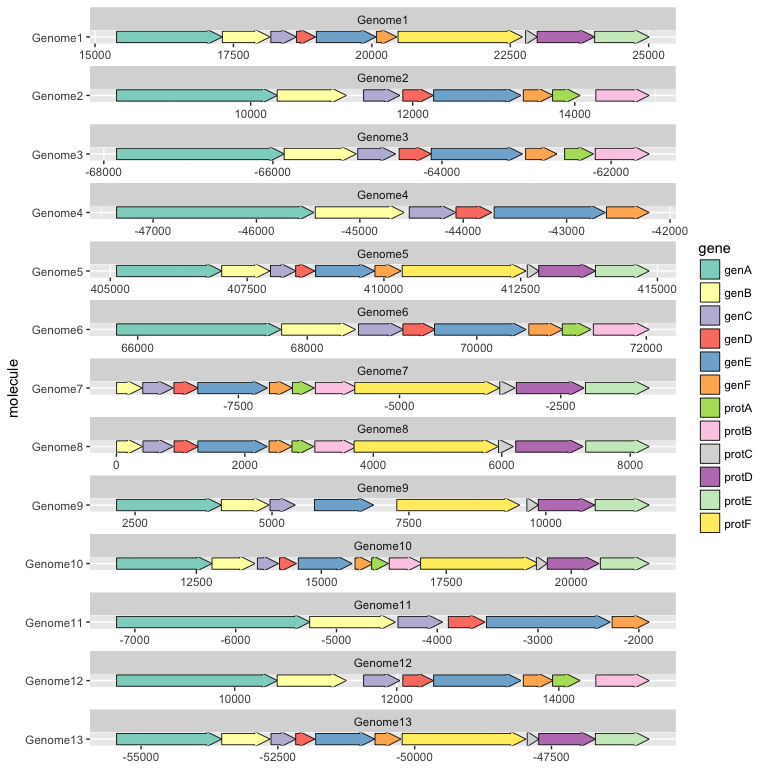
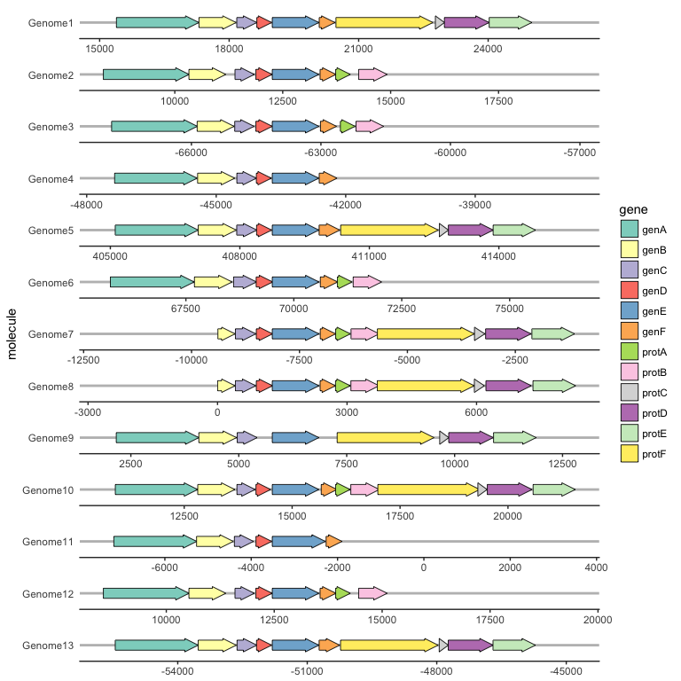

**'gggenes' is a (quite small) set of tools for drawing gene arrow maps with 'ggplot2.'**

Installation
------------

Install the release version of 'gggenes' from CRAN:

`install.packages("gggenes")`

If you want the development version, install it from GitHub:

`devtools::install_github("wilkox/gggenes")`

`geom_gene_arrow`
-----------------

`geom_gene_arrow` is a 'ggplot2' geom that represents genes with arrows. The start and end positions of the genes within their molecule(s) are mapped to the `xmin` and `xmax` aesthetics respectively. The `y` aesthetic must be mapped to the molecule(s). If you are drawing more than one molecule, and the numerical positions of the genes are not similar across molecules, you almost certainly want to facet the plot with `scales = "free"` to avoid drawing ridiculously large molecules with ridiculously tiny genes.

``` r
library(ggplot2)
library(gggenes)

ggplot2::ggplot(example_genes, ggplot2::aes(xmin = start, xmax = end, y =
                                            molecule, fill = gene)) +
  geom_gene_arrow() +
  ggplot2::facet_wrap(~ molecule, scales = "free", ncol = 1) +
  ggplot2::scale_fill_brewer(palette = "Set3")
```



`theme_genes`
-------------

Because the resulting plot can look cluttered, a 'ggplot2' theme `theme_genes` is provided with some sensible defaults.

``` r
ggplot2::ggplot(example_genes, ggplot2::aes(xmin = start, xmax = end, y =
                                            molecule, fill = gene)) +
  geom_gene_arrow() +
  ggplot2::facet_wrap(~ molecule, scales = "free", ncol = 1) +
  ggplot2::scale_fill_brewer(palette = "Set3") +
  theme_genes()
```


`make_alignment_dummies`
------------------------

Often you might want to a certain gene to be vertically aligned across the faceted molecules. A helper function `make_alignment_dummies` is provided that generates a set of 'dummy' genes such that, if the dummies are added to the plot with `geom_blank`, they will extend the range of each facet to visually align the selected gene across facets.

``` r
dummies <- make_alignment_dummies(
  example_genes,
  ggplot2::aes(xmin = start, xmax = end, y = molecule, id = gene),
  on = "genE"
)

ggplot2::ggplot(example_genes, ggplot2::aes(xmin = start, xmax = end, y =
                                            molecule, fill = gene)) +
  geom_gene_arrow() +
  ggplot2::geom_blank(data = dummies) +
  ggplot2::facet_wrap(~ molecule, scales = "free", ncol = 1) +
  ggplot2::scale_fill_brewer(palette = "Set3") +
  theme_genes()
```


